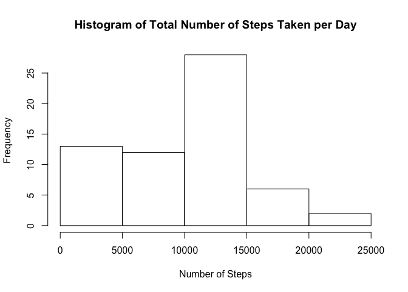
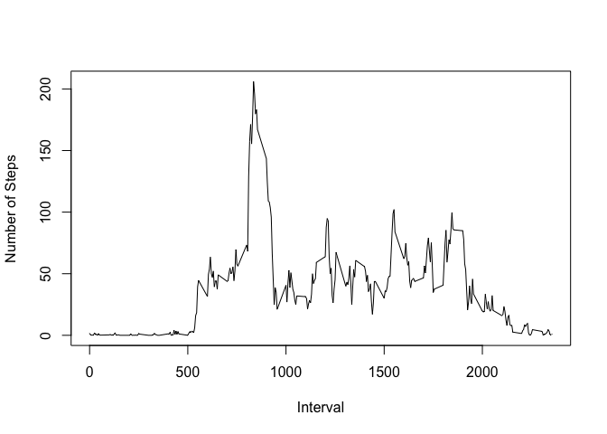
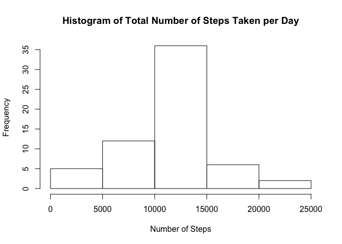

# Reproducible Research: Peer Assessment 1


## Loading and preprocessing the data

```r
options(scipen=1, digits=2)
library(lubridate)
library(dplyr)
library(lattice)
data <- read.table("activity.csv", stringsAsFactors = FALSE, header = TRUE, sep = ",")
```

## What is mean total number of steps taken per day?

```r
day_groups = group_by(data, date)
total_number_per_day <- summarize(day_groups, sum=sum(steps, na.rm=TRUE))
hist(total_number_per_day$sum, xlab = "Number of Steps", main="Histogram of Total Number of Steps Taken per Day")
```

 

```r
total_mean <- mean(total_number_per_day$sum, na.rm=TRUE)
total_median <- median(total_number_per_day$sum, na.rm=TRUE)
```
The mean and median of the total number of steps taken per day is 9354.23 and 10395, respectively.

## What is the average daily activity pattern?

```r
interval_groups <- group_by(data, interval)
average_per_interval <- summarize(interval_groups, mean=mean(steps, na.rm=TRUE))
plot(x=average_per_interval$interval, y = average_per_interval$mean, type="l", xlab="Interval", ylab="Number of Steps")
```

 

```r
max_interval <- average_per_interval[which.max(average_per_interval$mean),]$interval
```
On average across all the days in the dataset, interval 835 contains the maximum number of steps.

## Imputing missing values

```r
na_rows <- sum(is.na(data$steps))
```
There are 2304 missing (steps) values in the dataset.

To fill in the missing data, we use the mean from the respective interval, and code it as follows.

```r
#Create a new dataset that is equal to the original dataset
noNA_data <- data

#Replace the missing values in the dataset with the mean for that 5-minute interval
noNA_data[is.na(noNA_data$steps),]$steps <- average_per_interval[average_per_interval$interval == noNA_data[is.na(noNA_data$steps),]$interval]$mean

#To compare with the first part of the assignment
noNA_day_groups = group_by(noNA_data, date)
noNA_total_number_per_day <- summarize(noNA_day_groups, sum=sum(steps, na.rm=TRUE))
hist(noNA_total_number_per_day$sum, xlab = "Number of Steps", main="Histogram of Total Number of Steps Taken per Day")
```

 

```r
noNA_total_mean <- mean(noNA_total_number_per_day$sum, na.rm=TRUE)
noNA_total_median <- median(noNA_total_number_per_day$sum, na.rm=TRUE)
```
Once, we fill the missing values with the mean for the respective 5-minute interval,the mean and median of the total number of steps taken per day is 10766.19 and 10766.19, respectively.
These mean and median values change from 9354.23 and 10395 to 10766.19 and 10766.19, respectively.
Compared to the data before imputing missing values, the latest histogram shows a more normal distribution of the total number of steps.

## Are there differences in activity patterns between weekdays and weekends?

```r
noNA_data <- mutate(noNA_data, daystatus=ifelse(weekdays(ymd(date)) %in% c("Saturday", "Sunday"), "weekend", "weekday"))
noNA_daystatus_interval_groups <- group_by(noNA_data, daystatus, interval)
noNA_average_per_daystatus_interval <- summarize(noNA_daystatus_interval_groups, mean=mean(steps, na.rm=TRUE))
xyplot(noNA_average_per_daystatus_interval$mean ~ noNA_average_per_daystatus_interval$interval | noNA_average_per_daystatus_interval$daystatus, type="l", layout = c(1,2), xlab = "Interval", ylab = "Number of steps")
```

 

From this plot, we found that the maximum number of steps during the weekday is obtained around 800th 5-minute interval, i.e. 13:30. Moreover, this maximum number of step is quite extreme. This explains that the geeks move much often around this time than the rest of the day. This perhaps happens because they have to go out for lunch.
On the other hand, during weekend, there is no extreme peak in the number of steps.
